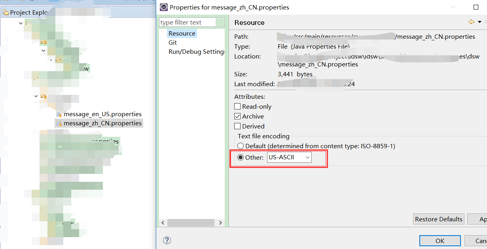
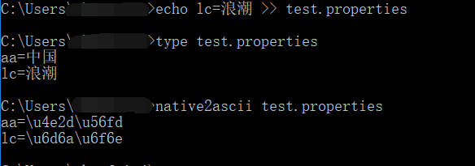

# 中文转换unicode码

* 中文转unicode码

```
国际化需要将中文转换成unicode码
```

### 中文转uniceode

#### 参考资料

- [properties文件中含有中文转换为unicode的方法](https://jingyan.baidu.com/article/363872eccf4f266e4ba16f2b.html)

有两种方法，一种使用ecipse，另一种使用jdk自带的native2ascii.exe

##### 1. eclipse 设置编码格式

修改properties文件编码格式，然后输入中文，就直接自动转换成unicode码了



##### 2. native2ascii

###### 前提：系统安装了jdk

执行过程如下图



##### 附加：[开源中国  在线编码格式转换](http://tool.oschina.net/encode?type=3)