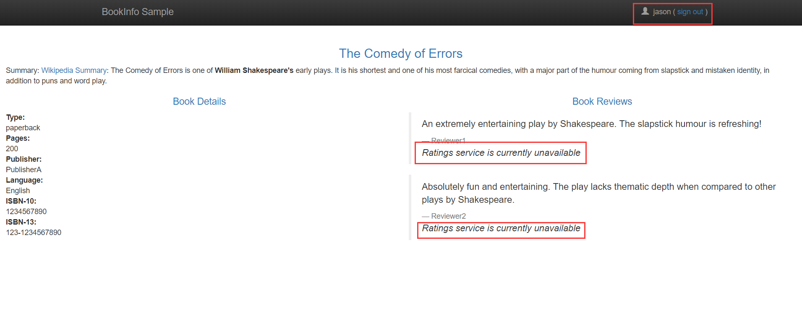

# 0.8 功能特性

### 配置请求路由

[官网文档](https://istio.io/docs/tasks/traffic-management/request-routing/)

基于bookinfo demo

1. 配置所有请求流量都转发给review v1, [yml](../../yaml/bookinfo/route-rule-all-v1.yml)

    `istioctl create -f samples/bookinfo/routing/route-rule-all-v1.yaml`
    
    The corresponding subset definitions can be displayed using istioctl get destinationrules -o yaml.
    
    访问 nodeIp:31380/producepage，多次刷新页面，可以发现 “Book Reviews”部分全都显示不带星评价，即review v1版本。
    
2. 指定用户可以访问特定版本

    eg: 指定user jason访问review v2(黑色五星评价), [yml](../../yaml/bookinfo/route-rule-reviews-test-v2.yaml)
    
    `istioctl replace -f samples/bookinfo/routing/route-rule-reviews-test-v2.yaml`

    访问 nodeIp:31380/productpage，可以发现使用jason用户登录的都将显示黑色五角星的评价即review v2版本，其他用户仍然显示不带星的评价。
    
    这样做好处就是，我们可以先小范围测试v2版本，一旦测试通过，就可以逐步把所有流量转到v2。

    \* 删除用户的路由规则，可以使用 `istioctl delete -f [yaml文件路径]`
    
### 故障注入

参考文档：[官网](https://istio.io/docs/tasks/traffic-management/fault-injection/)、[翻译](https://blog.csdn.net/ybt_c_index/article/details/80737233)

1. 延时delay [route-rule-rating-test-delay.yml](../../yaml/bookinfo/route-rule-rating-test-delay.yml)

    `istioctl create -f samples/bookinfo/routing/route-rule-ratings-test-delay.yaml`
    
    >观察应用行为 
     以用户 “jason” 登陆，如果应用的前端页面正确的处理延时，我们期望大约加载7s。为了观察页面响应时间，开放开发者工具菜单的IE、Chrome或Firefox（通常，命令组合 Ctrl+Shift+I or Alt+Cmd+I ）、tag Network，和重新加载 productpage 的网页。 
     你可能会观察到网页加载了大约6s。评论部分将展示： Sorry, product reviews are currently unavailable for this book.
     
     >Understanding what happened
     整个reviews服务失败的原因是我们的Bookinfo应用有一个bug。在productpage 和reviews 服务间的超时时间(3s + 1 retry = 6s total)低于reviews 和ratings 服务之间的超时时间 (10s)。这种bug发生在典型由不同队伍分别开发不同微服务的企业应用。Istio的故障注入规则在不影响终端用户的情况下，帮助你确认这种反常现象。
 
2. 中断abort [route-rule-ratings-test-abort.yaml](../../yaml/bookinfo/route-rule-ratings-test-abort.yaml)

    `kubectl replace -f route-rule-ratings-test-abort.yaml`
    
    可以发现如果使用jason用户登录，Book Reviews 将会直接显示出来，
    并提示“Ratings service is currently unavailable”，说明rating服务不可用
    
    

    
### 流量迁移 Traffic Shifting

`kubectl replace -f route-rule-reviews-50-v3.yaml`

[route-rule-reviews-50-v3.yaml](../../yaml/bookinfo/route-rule-reviews-50-v3.yaml)
    
可以将应用流量从某个版本逐步迁移到另一个版本，利用istio的加权路由特性(weighted routing)。

When version v3 of the reviews microservice is considered stable, we can route 100% of the traffic to reviews:v3:
`istioctl replace -f samples/bookinfo/routing/route-rule-reviews-v3.yaml` 
  
> In this task we migrated traffic from an old to new version of 
the reviews service using Istio’s weighted routing feature. 
Note that this is very different than version migration using deployment 
features of container orchestration platforms, 
which use instance scaling to manage the traffic. 
With Istio, we can allow the two versions of the reviews service 
to scale up and down independently, 
without affecting the traffic distribution between them.

>容器编排工具(例如k8s)，版本的迁移，是通过改变实例个数来实现的。
通过istio，不同服务版本扩容或者缩容是独立的，并不会请求到不同版本的流量分配。

###设置请求超时 Setting Request Timeouts


### Ingress 流量控制

使用[httpbin](https://github.com/istio/istio/blob/release-0.8/samples/httpbin) sample

1. 先部署httpbin这个应用，这里采用不自动边车注入的方式，
进到istio-0.8.0目录,
执行 `kubectl apply -f <(istioctl kube-inject -f samples/httpbin/httpbin.yaml)`


>An ingress Gateway describes a load balancer operating 
at the edge of the mesh receiving incoming HTTP/TCP connections. 
It configures exposed ports, protocols, etc., 
but, unlike Kubernetes Ingress Resources, 
does not include any traffic routing configuration. 
Traffic routing for ingress traffic is instead configured using Istio routing rules, 
exactly in the same was as for internal service requests.
 
>In the following subsections we configure a Gateway on port 80 for unencrypted HTTP traffic first. 
Then we add a secure port 443 for HTTPS traffic.  
    
2. 配置Http方式 [gateway.yml](../../yaml/httpbin/httpbin-gateway.yml)  [virtualservice.yml](../yaml/httpbin/httpbin-virtualservice.yml)
  
` kubectl replace -f httpbin-gateway.yml`

` kubectl replace -f httpbin-virtualservice.yml`

【注意】 如果之前没有创建httpbin-gateway，需要使用create而非replace，httpbin-virtualservice同理。

`curl --resolve httpbin.example.com:$INGRESS_PORT:$INGRESS_HOST -HHost:httpbin.example.com -I http://httpbin.example.com:$INGRESS_PORT/status/200`

控制台返回结果类似[这样](../../yaml/httpbin/httpbin-log.md#Http方式访问)

3. 配置安全端口https方式
   
    1)  使用https的方式，为ingress生成证书和密钥，命令：
    `openssl req -x509 -nodes -days 365 -newkey rsa:2048 -keyout /tmp/tls.key -out /tmp/tls.crt -subj "/CN=httpbin.example.com"
`
    2)  创建secret
        使用 kubectl 在命名空间 istio-system 创建 istio-ingress-certs secret。
        >注意：secret在命名空间 istio-system 中必须被称为 istio-ingress-certs ，因为它
        要被加载到Isito Ingress。
        
        `kubectl create -n istio-system secret tls istio-ingressgateway-certs --key /tmp/tls.key --cert /tmp/tls.crt
`

         默认istio-system中所有service account都有权限访问私钥和证书，会有证书泄漏的风险。可以通过RBAC进行控制来保护私钥和证书。、
         
     3) 修改并更新[httpbin-gateway](../../yaml/httpbin/httpbin-gateway.yml)，Add to the previous Gateway definition a server section for the port 443.
        
        The location of the certificate and the private key MUST be /etc/istio/ingressgateway-certs, or the gateway will fail to load them.
        
        `kubectl replace -f httpbin-gateway.yml`
        
        >Access the httpbin service by HTTPS, sending an HTTPS request by curl to SECURE_INGRESS_PORT. 
        Here we use curl’s -k option to instruct curl not to check our certificate 
        (since it is a fake certificate we created for testing the Gateway only, curl is not aware of it).
     
        控制台返回结果类似[这样](../../yaml/httpbin/httpbin-log.md#Https方式访问)
     
4. clean up
    
    ```
    istioctl delete gateway httpbin-gateway
    istioctl delete virtualservice httpbin
    kubectl delete --ignore-not-found=true -n istio-system secret istio-ingressgateway-certs
    kubectl delete --ignore-not-found=true -f samples/httpbin/httpbin.yaml
    ```
    
### Control Egress Traffic 

>默认情况下，启用Istio的服务无法访问集群外的URL，
因为在pod中使用iptables将所有出站流量透明地重定向到仅处理集群内目的地的sidecar代理。 
这个task描述如何配置Istio向启用Istio的客户端暴露外部服务。
你将了解如何通过定义 ServiceEntry的配置启用对外部服务的访问，
或者简单地绕过特定范围IP的Istio代理。
    
    
    
    
    
    
    
    
### ms demo 

一个springboot的应用，指定两个不同的上下文/msa和/msb，然后测试msa和msb互相调用，通过环境变量REMOTE_RUL指定调用的url

istio-tutorial-ms:v1
istio-tutorial-ms:v2


kubectl apply -f <(istioctl kube-inject -f msa-deployment.yml )
kubectl apply -f <(istioctl kube-inject -f msb-deployment-v1.yml)
kubectl apply -f <(istioctl kube-inject -f msb-deployment-v2.yml)


对于一个服务，只有一个virtualservice设置会生效。


指定所有请求都到msb的v1版本
kubectl apply -f <(istioctl kube-inject -f ms-virtualsevice-all-to-msb-v1.yml)

指定请求msb延时，如果实验超时，可以修改ms-virtualsevice.yml 把timeout注释掉
ms-virtualsevice-delay-msb-v1.yml
    
    
### 熔断 Circuit Breaking    

进入[httpbin目录](../../yaml/httpbin)

`kubectl create -f httpbin.yaml -f httpbin-gateway.yml -f httpbin-virtualservice.yml  -f httpbin-destinationrule.yml`

前提要确定其他gateway没有暴露80端口的，否则会请求不到。

验证：类似[这样](../../yaml/httpbin/httpbin-log.md#Http方式访问)

使用一个荷载测试客户端 fortio 。
用这个客户端，我们可以控制连接数，并发和外部HTTP调用的延迟。在这步，
我们创建了一个注入了Istio sidecar proxy的客户端，这样我们的网络交互由Istio管理：

`kubectl apply -f <(istioctl kube-inject -f fortio-deploy.yaml)`

[httpbin-destinationrule.yml](../../yaml/httpbin/httpbin-destinationrule.yml) 
里面定义了最大支持一个连接1个并发请求


