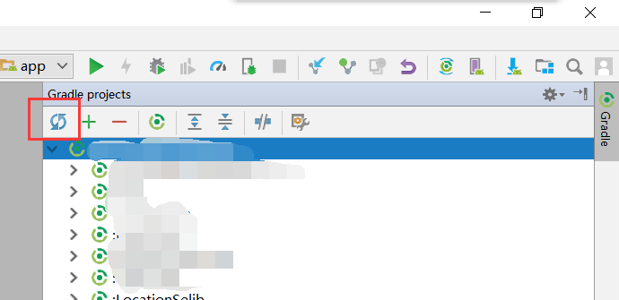
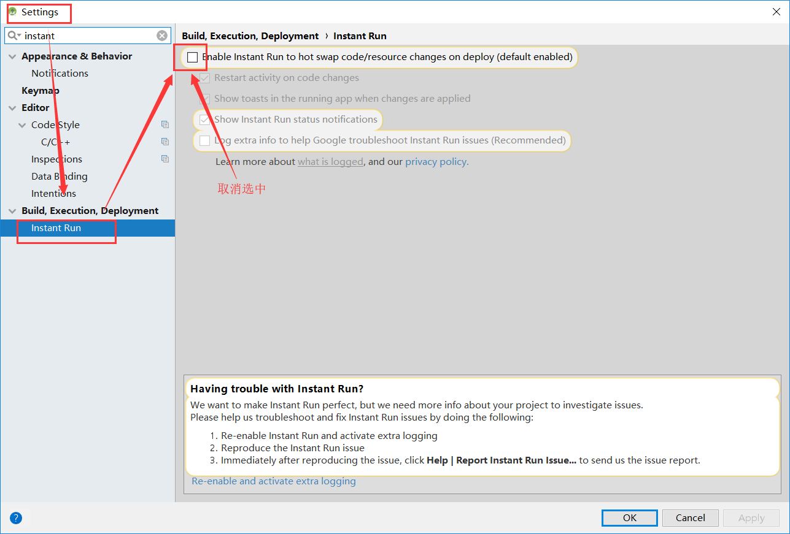

# 使用Android Studio开发过程中遇到的问题

### 2018-07-31
### 1. run 安卓项目适合，提示“Please select Android Sdk”

解决方法: 在"Gradle properties" 窗口 点击同步按钮，ok！

参考: https://stackoverflow.com/questions/34353220/android-studio-please-select-android-sdk

### 2018-08-01
### 2. 使用Android Studio 开发项目需要关闭Instan Run，否则，可能会报appt2相关错误

解决方法: 针对Android studio 3.1版本: File >> Settings >> Build Exception Run >> Instant Run ,然后取消勾选" "Enable Instant Run to hot swap code/resource changes on deploy (default enabled)" 

参考: https://github.com/ftctechnh/ftc_app/wiki/Disabling-Android-Studio-Instant-Run

