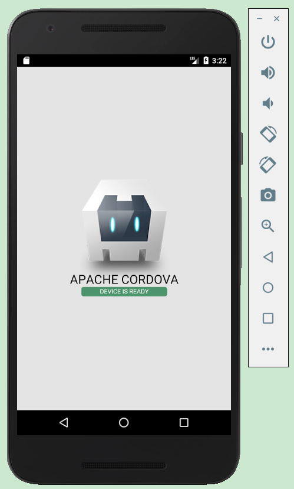

# 移动开发框架Apache Cordova学习

### 参考资料

* [Cordova中文网](http://cordova.axuer.com/docs/zh-cn/latest/guide/overview/index.html)

### 说明

本例中使用的软件环境
* windows 10
* npm  3.10.8
* nodejs 6.9.1
* cordova  8.0.0

### 安装Cordova CLI

1) 需要安装了nodejs
2) windows下安装
```
 C:\> npm install -g cordova
 # -g标志是告诉 npm 我们全局安装 cordova。否则我们将会安装在当前工作目录的 node_modules子目录。

 # 安装完成后，你应该能够在命令行中运行cordova命令，在没有任何参数的时候会打印一些帮助信息。
```

### 创建第一个应用

```
F:\monster\android\cordova\hello>cordova create hello com.example.hello helloworld

F:\monster\android\cordova\hello>cd hello

F:\monster\android\cordova\hello>tree
文件夹 PATH 列表
卷序列号为 341A30F6 110E:1924
F:.
├─hooks
├─platforms
│  ├─android
│  ├─windows
│  ├─ios
├─plugins
├─merges/               # 提供了特定平台部署特定资源的地方。每个特定平台在merges中的子目录反映了www 源代码树中的结构， 允许你重写和添加文件。
│  ├─android
│  ├─windows
│  ├─ios
├─res
│  ├─icon
│  │  ├─android
│  │  ├─bada
│  │  ├─bada-wac
│  │  ├─blackberry
│  │  ├─blackberry10
│  │  ├─ios
│  │  ├─tizen
│  │  ├─webos
│  │  └─windows-phone
│  └─screen
│      ├─android
│      ├─bada
│      ├─bada-wac
│      ├─blackberry
│      ├─blackberry10
│      ├─ios
│      ├─tizen
│      ├─webos
│      └─windows-phone
└─www
    ├─css
    ├─img
    └─js
    

F:\monster\android\cordova\hello>cordova platform ls
Installed platforms:

Available platforms:
  android ~7.0.0
  browser ~5.0.1
  ios ~4.5.4
  osx ~4.0.1
  windows ~5.0.0
  www ^3.12.0

F:\monster\android\cordova\hello>
F:\monster\android\cordova\hello>
F:\monster\android\cordova\hello>cordova platform add android --save
Using cordova-fetch for cordova-android@~7.0.0
Adding android project...
Creating Cordova project for the Android platform:
        Path: platforms\android
        Package: com.example.hello
        Name: helloworld
        Activity: MainActivity
        Android target: android-26
Subproject Path: CordovaLib
Subproject Path: app
Android project created with cordova-android@7.0.0
Android Studio project detected
Android Studio project detected
Discovered plugin "cordova-plugin-whitelist" in config.xml. Adding it to the project
Installing "cordova-plugin-whitelist" for android
               This plugin is only applicable for versions of cordova-android greater than 4.0. If you have a previous platform version, you do *not* need this plugin since the whitelist will be built in.
Adding cordova-plugin-whitelist to package.json
Saved plugin info for "cordova-plugin-whitelist" to config.xml
--save flag or autosave detected
Saving android@~7.0.0 into config.xml file ...

F:\monster\android\cordova\hello>cordova platform ls
Installed platforms:
  android 7.0.0
Available platforms:
  browser ~5.0.1
  ios ~4.5.4
  osx ~4.0.1
  windows ~5.0.0
  www ^3.12.0
  
F:\monster\android\cordova\hello>cordova requirements
Android Studio project detected

Requirements check results for android:
Java JDK: installed 1.8.0
Android SDK: installed true
Android target: installed android-26,android-24
Gradle: installed D:\Program Files\Android\Android Studio\gradle\gradle-4.4\bin\gradle

F:\monster\android\cordova\hello>cordova build android
Android Studio project detected
ANDROID_HOME=F:\monster\android\sdk
JAVA_HOME=D:\Program Files\Java\jdk1.8.0_91
studio
Starting a Gradle Daemon (subsequent builds will be faster)
BUILD SUCCESSFUL in 13s
...
BUILD SUCCESSFUL in 44s
47 actionable tasks: 47 executed
Built the following apk(s):
        F:\monster\android\cordova\hello\platforms\android\app\build\outputs\apk\debug\app-debug.apk


# 执行下面命令过程中遇到问题
F:\monster\android\cordova\hello>cordova emulate android
No emulator specified, defaulting to Nexus_5X_API_24
Waiting for emulator to start...
(node:16480) UnhandledPromiseRejectionWarning: Unhandled promise rejection (rejection id: 1): Failed to execute shell command "getprop,dev.bootcomplete"" on device: Error: F:\monster\android\sdk\platform-tools\adb.exe: Command failed with exit code 1 Error output:
error: device still connecting

# 然后通过google，找到解决方法，参考：https://stackoverflow.com/questions/50731082/cordova-emulate-android-fails-with-device-is-still-connecting
# 修改 platform/android/cordova/lib/emulator.js adding (error.message.indexOf('device still connecting') > -1) inside if clause on line 344 or inside module.exports.wait_for_emulator method so the process won't be terminated and just keep looping until it can start adb.shell.
# 重新执行上面的命令，不报这个错了，但是又报另一个错啊，error: device still authorizing
# 在https://stackoverflow.com/questions/23081263/adb-android-device-unauthorized，这里面有点说明，但是没有执行
# 只是第二次重新执行上面的命令，发现居然可以运行了，效果如下
```




### 更新Cordova和你的项目
在安装cordova工具之后，你可以运行下面命令更新到最新版本:
~sudo npm update -g cordova`

用下面语法安装指定版本:
`sudo npm install -g cordova@3.1.0-0.2.0`

运行`cordova -v`查看当前版本。要查找最新的cordova版本，可以运行:
`npm info cordova version`

更新完cordova后，更新目标项目的平台:
`cordova platform update android --save`

`cordova platform update ios --save`


### Cordova和Android
>原生的Android应用通常由一系列活动组成，用于与用户交互。
活动可以被认为一个单独的屏幕，组成了一个应用程序。
在应用中不同的任务通常拥有自己的活动。每个活动都有自己的生命周期，
作为活动的进入和离开用户设备前景维护。

>比较起来，Android平台的Cordova应用运行在一个嵌入单独Android活动中的Webview中。
活动的生命周期通过文档事件触发暴漏给你的应用程序，
事件不保证与Android的生命周期对齐，
但可以提供保存和恢复状态的指导方针。