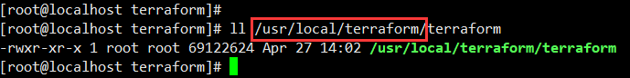
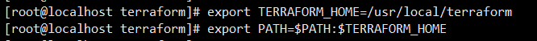
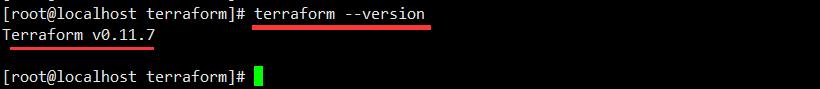
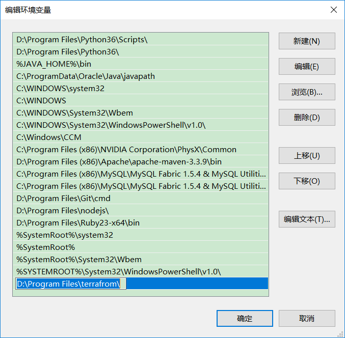
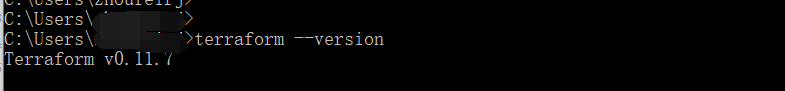

#Terraform 安装
* Linux 
* Windows 

###参考
* https://www.terraform.io/intro/getting-started/install.html

### 主要步骤
1. 获取Terraform可执行文件
2. 设置环境变量
3. 检验安装是否成功

### 准备

访问https://www.terraform.io/downloads.html，下载对应操作系统Terraform可执行文件

1. Linux (以centos为例)
  
   1) 拷贝二进制文件到Linux系统目录下，这里复制到/usr/local/terraform/ 目录，
   并确保该文件具有可执行权限，如果没有使用`chmod +x terraform`,增加可执行权限
    
    
    2) 设置环境变量，可以通过执行一下命令，设置临时环境变量
    
                export TERRAFORM_HOME=/usr/local/terraform
        
                export PATH=$PATH:$TERRAFORM_HOME
    
         可以将上面两行代码添加到 `/etc/profile`，然后执行`source /etc/profile`设置永久变量
    
    3) 验证安装是否成功，在终端执行`terrafrom --version` ，如果控制台返回版本号，说明安装成功
    
    

2. Windows (win 10)

    1) 拷贝可执行文件到windows目录下，这里将terrafrom.exe复制到`D:\Program Files\terrafrom`
    
    
    
    2) 设置环境变量，win10下，依次打开`控制面板\所有控制面板项\系统`，
    然后选择`高级系统设置` `环境变量`，在`Path`中增加terrafrom环境变量
    
    
    3) 验证方式同linux，在windows中打开cmd，然后输入命令`terraform --version`
    
    